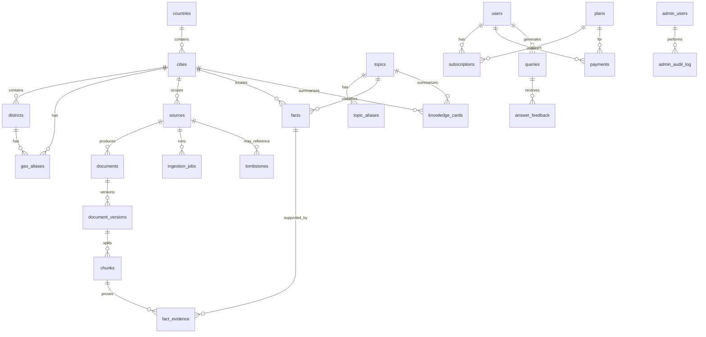

# Модель данных relocate_helper

> Промпт 2 — PostgreSQL + async SQLAlchemy 2.x + Alembic.  
> Источник требований: [TZ_telegram_parser_ai.md](../TZ_telegram_parser_ai.md) §8.3, §2.2.

## Обзор

Схема покрывает полный контур MVP: справочники географии и тем, источники и документы, извлечённые знания, задания импорта, биллинг, аналитику и администрирование. Все временные метки — **UTC** (`timestamptz`).

Жизненный цикл публикации знаний: `draft` → `needs_review` → `published` / `rejected` / `hidden` (enum `publication_status`).

## ER-диаграмма (основные связи)



## Группы таблиц

| Группа | Таблицы | Назначение |
|--------|---------|------------|
| География | `countries`, `cities`, `districts`, `geo_aliases` | Справочники и синонимы для retrieval/классификации |
| Темы | `topics`, `topic_aliases` | Тематики MVP + синонимы; `freshness_days` для политики свежести |
| Источники | `sources` | Реестр Telegram/web/file/youtube; `legal_basis` nullable в test mode |
| Документы | `documents`, `document_versions`, `chunks` | Версионирование, idempotency, FTS + pgvector |
| Знания | `facts`, `fact_evidence`, `knowledge_cards` | Структурированные факты, доказательства, агрегированные карточки |
| Обработка | `ingestion_jobs`, `model_runs` | Импорт, LLM/embeddings прогоны и стоимость |
| Биллинг | `users`, `plans`, `subscriptions`, `payments`, `promo_codes` | Telegram-пользователи и тарифы (Stars — позже) |
| Аналитика | `usage_events`, `answer_cache`, `queries`, `answer_feedback` | Лимиты, кэш; **без полного текста вопроса** в `queries` |
| Админ | `admin_users`, `admin_audit_log`, `tombstones` | Доступ, аудит, минимальные записи после удаления |

## Ключевые ограничения

- **Confidence** `facts`, `fact_evidence`, `knowledge_cards`: CHECK `0..1`.
- **Цены** `facts.price_amount`: CHECK `> 0` (если задано).
- **Период актуальности**: `valid_to >= valid_from` (если оба заданы).
- **Идемпотентность**:
  - `documents.idempotency_key` — UNIQUE;
  - `(source_id, external_id)` — UNIQUE;
  - `ingestion_jobs.idempotency_key` — UNIQUE;
  - `payments.idempotency_key`, `payments.telegram_payment_id` — UNIQUE.
- **Optimistic locking**: колонка `version` на `sources`, `documents`, `facts`, `knowledge_cards`, `topics`.
- **Embeddings**: `chunks.embedding vector(1024)` — размерность из `EMBEDDING_DIMENSION`; HNSW-индекс для cosine search.
- **FTS**: `chunks.search_vector` — generated `tsvector`, GIN-индекс.

## Правила удаления

| Сущность | Стратегия | Поведение |
|----------|-----------|-----------|
| Документ / chunk (право на удаление) | **Физическое удаление контента** + `tombstones` | Контент и производные удаляются из object storage и БД; остаётся минимальная tombstone-запись без пользовательского текста |
| Документ удалён в источнике | Статус `deleted_at_source` | Chunks → `deleted`; зависимые facts понижаются (этап processing) |
| Обезличивание | Статус `redacted` | Аналогично erasure; audit в `admin_audit_log` |
| Facts / cards | Статусная машина | `published` → `needs_review` при потере evidence или истечении freshness |
| Admin users | `is_active=false` | Soft-disable, без удаления audit trail |
| Queries | Retention 90 дней | Только hash/метаданные, не полный текст вопроса |

Операция `Database.mark_document_deleted()` (промпт 2): переводит документ в `redacted`, создаёт `tombstone` и запись `admin_audit_log`. Физическое удаление бинарного контента выполняется на этапе ingestion/storage (промпт 3).

## Seed-данные (идемпотентно)

После миграции `001_initial`:

- **География**: Brazil / Florianópolis + aliases (Florianópolis, Флорианопolis, Floripa).
- **8 тем** из [product-decisions.md](product-decisions.md) §1.3 с синонимами.
- **4 plans**: trial, 1/7/30 дней (цены Stars — NULL до включения billing).

Повторный вызов `seed_reference_data()` безопасен (`ON CONFLICT DO NOTHING`).

## Миграции

```bash
# upgrade
py -3.13 -m alembic upgrade head

# downgrade последней
py -3.13 -m alembic downgrade base
```

Переменная `DATABASE_URL` / `TEST_DATABASE_URL` — через [config.py](../src/relocate_helper/common/config.py).

## Файлы реализации

| Путь | Описание |
|------|----------|
| `src/relocate_helper/db/models/` | ORM-модели |
| `src/relocate_helper/db/enums.py` | Доменные enum |
| `src/relocate_helper/db/session.py` | Async engine / session |
| `src/relocate_helper/db/repository.py` | Транзакции, tombstone, audit |
| `src/relocate_helper/db/seed.py` | Python seed (идемпотентный) |
| `alembic/versions/001_initial_schema.py` | Начальная миграция + SQL seed |
